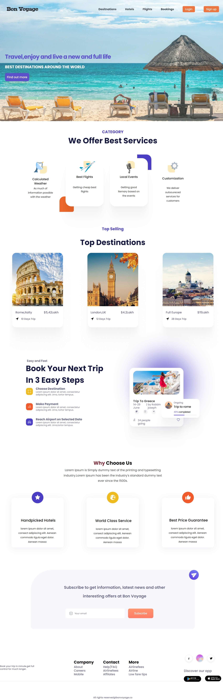

<!-- @format -->

# Travel landing page

## Screenshot

## Description

This project is a responsive travel landing page created using pure HTML and CSS. It aims to showcase a travel destination and encourage users to explore further.

## Features

Responsive design that adapts to various screen sizes and devices.
Visually appealing layout with engaging images and content.
Interactive elements to enhance user experience.
Utilizes HTML and CSS styling.

## Demo

A live demo of the project can be found [link](https://land-tour.netlify.app/).

## Installation

Clone the repository: git clone [clone](https://github.com/Suvathik0119/tour-lanka.git)

## Usage

Open the index.html file in your preferred web browser to view the landing page. Explore the different sections and interactive elements to get a feel for the travel experience.

